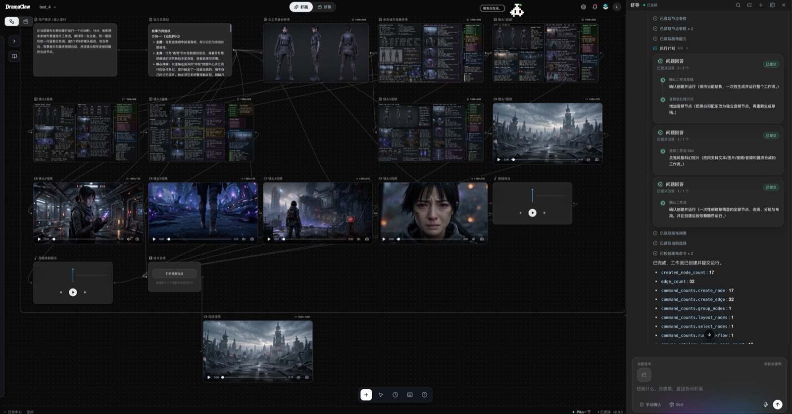
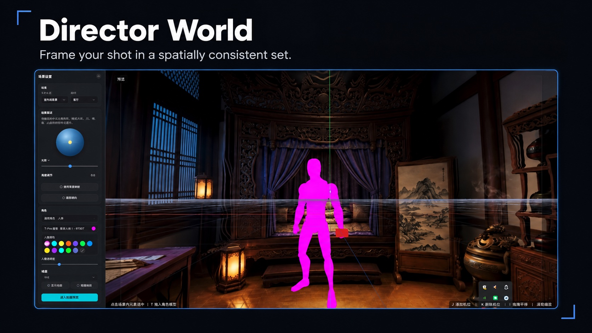
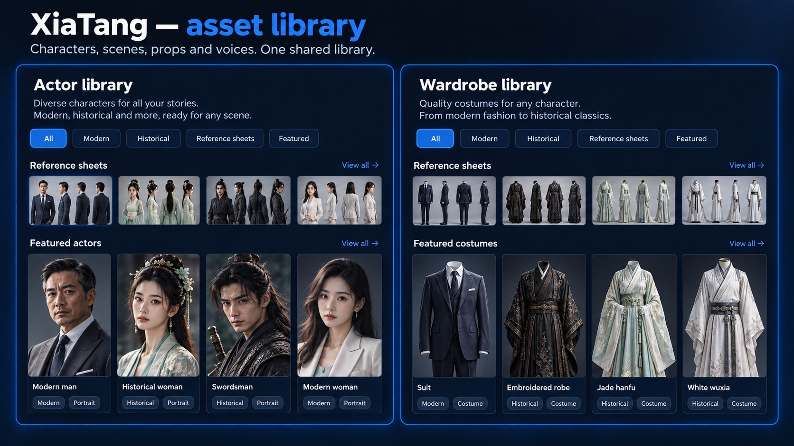
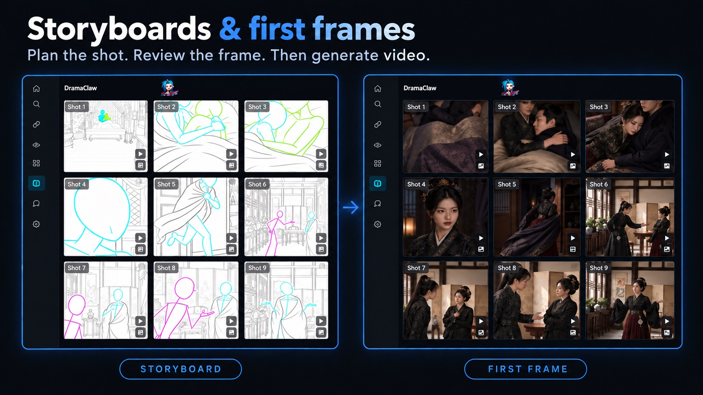
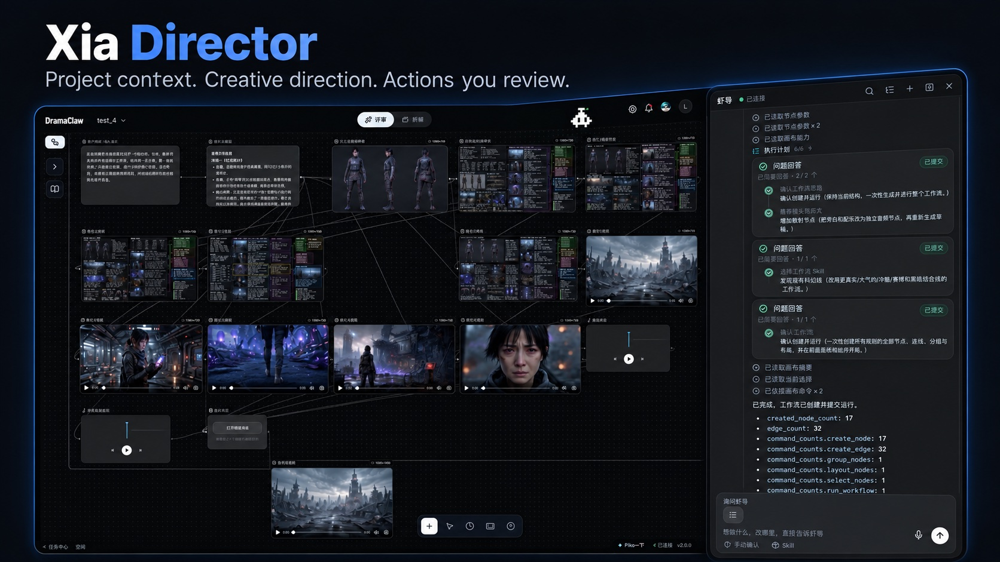

<div align="center">

<!-- TBD: 替换为正式 logo assets/logo.svg -->
<h1>DramaClaw</h1>

## Make Your Own DC.

<p align="left">

他们说你过时了。<br/>
也许是「打工」这件事过时了。<br/>
<br/>
AI 时代，真正的问题不是机器会不会替代人。<br/>
真正的问题是：<br/>
谁拥有机器？<br/>
谁拥有流程？<br/>
谁拥有工业化生产力？<br/>
<br/>
如果答案永远是大厂，<br/>
那 AI 就不是平权。<br/>
那只是新的高墙。<br/>
<br/>
我是 Eric。<br/>
<br/>
这不是 demo。<br/>
不是玩具。<br/>
不是阉割版。<br/>
<br/>
这是一条我们团队自己每天在跑的漫剧工业化生产线。<br/>
从脚本到分镜，从资产到成片，全链路。<br/>
<br/>
因为人不是牛马。<br/>
因为创造力，是人类最后的防线。<br/>
<br/>
DramaClaw 要做的事很简单：<br/>
<br/>
<strong>拆墙。</strong><br/>
<br/>
把过去只有大厂才有的漫剧工业化能力，<br/>
交到普通创作者手里。<br/>
<br/>
代码已就位。<br/>
认同的话，留下一颗 ⭐。<br/>
我们继续拆。

</p>

<p align="left">

<strong>对，你可以拿它赚钱。</strong><br/>
DramaClaw 采用 <a href="../LICENSE">Elastic License 2.0</a>。自己跑、自己改、自己卖，随便 ——<br/>
单机版本可以自由商用，不用申请，不用付费。<br/>
我们只有一个请求：在界面角落留一行小字「基于 DramaClaw」。<br/>
唯一还没开的门，是把它包成 SaaS 卖给别人；这条授权暂不开放。<br/>
原因和常见问题：<a href="https://github.com/dramaclaw/dramaclaw/issues/475">#475</a>。

</p>

<br/>

[](../LICENSE)
[](https://github.com/dramaclaw/dramaclaw/stargazers)
[](https://github.com/dramaclaw/dramaclaw/releases)
[](#quick-start)

[English](../README.md) &nbsp;|&nbsp; **简体中文** &nbsp;|&nbsp; [Tiếng Việt](./README_vi.md) &nbsp;|&nbsp; [ไทย](./README_th.md) &nbsp;|&nbsp; [官网](https://dramaclaw.ai) &nbsp;|&nbsp; [文档](../docs/zh/README.md) &nbsp;|&nbsp; [快速开始](../docs/zh/getting-started/quickstart.md)

</div>

<br/>

<p align="center">
  
</p>

<!--
  演示视频 —— 上传完成后，把 user-attachments 链接单独一行粘到下面。
  上传方式：在 github.com 新建一个 Issue（别提交），把 demo 视频拖进正文，
  等它上传完会自动生成 https://github.com/user-attachments/assets/...mp4 链接，
  复制后粘到下面，再把 Issue 取消即可。GitHub 会把独占一行的 URL 渲染成内联播放器。

  https://github.com/user-attachments/assets/REPLACE-AFTER-UPLOAD
-->

<p align="center">
  <sub>🎬 宣传片：<a href="https://www.bilibili.com/video/BV1iQV26cE4S">Bilibili</a> &nbsp;·&nbsp; <a href="https://www.youtube.com/watch?v=64apa3maxK0">YouTube</a></sub>
</p>

<br/>

<div align="center">

## 🎬 用 DramaClaw 制作

<sub>我们团队用这条流水线亲手制作的真实短剧 &mdash; 点击链接即可播放。</sub>

<table>
  <tr>
    <td align="center" width="205" valign="top">
      <br/>
      <b>归灵司</b><br/>
      <a href="https://nfg-web-assets.cdnfg.com/dramaclaw/guilingsi/guilingsi-ep01.mp4">▶ 第 1 集</a>
    </td>
    <td align="center" width="205" valign="top">
      <br/>
      <b>鲁班</b><br/>
      <a href="https://nfg-web-assets.cdnfg.com/dramaclaw/luban/luban-ep01.mp4">▶ 第 1 集</a>
    </td>
    <td align="center" width="205" valign="top">
      <br/>
      <b>师兄你怎么不舔了</b><br/>
      <a href="https://nfg-web-assets.cdnfg.com/dramaclaw/shixiong-butianle/shixiong-butianle-ep01.mp4">▶ 第 1 集</a>
    </td>
  </tr>
  <tr>
    <td align="center" width="205" valign="top">
      <br/>
      <b>天命不可欺</b><br/>
      <a href="https://nfg-web-assets.cdnfg.com/dramaclaw/tianmingbukeqi/tianmingbukeqi-ep02.mp4">▶ 第 02 集</a> &nbsp;·&nbsp; <a href="https://nfg-web-assets.cdnfg.com/dramaclaw/tianmingbukeqi/tianmingbukeqi-ep58.mp4">第 58 集</a>
    </td>
    <td align="center" width="205" valign="top">
      <br/>
      <b>乌龙仙途</b><br/>
      <a href="https://nfg-web-assets.cdnfg.com/dramaclaw/wulongxiantu/wulongxiantu-ep01.mp4">▶ 第 1 集</a>
    </td>
    <td align="center" width="205" valign="top">
      <br/>
      <b>非遗㑇舞</b><br/>
      <a href="https://nfg-web-assets.cdnfg.com/dramaclaw/feiyi-zhouwu/feiyi-zhouwu.mp4">▶ 播放</a>
    </td>
  </tr>
</table>

<sub>更多片段：
<a href="https://nfg-web-assets.cdnfg.com/dramaclaw/3d-anime-montage-demo/3d-anime-montage-demo.mp4">3D 动漫混剪 demo</a> &nbsp;·&nbsp;
<a href="https://nfg-web-assets.cdnfg.com/dramaclaw/dongtai-dadou/dongtai-dadou.mp4">动态打斗</a></sub>

</div>

<br/>

## DramaClaw 是什么？

DramaClaw 是一条**源码可见的 AI 漫剧工业化生产线** —— 而且越来越不止于漫剧，任何想用生成模型讲的视觉故事都可以在这里做。它有两张面孔，共用一个资产库和一个智能体：

- **虾画 —— 无限画布。** 节点式创作台，图片、视频、音频、3D 场景、剧本在画布上自由生成、编辑、连线，满意的结果再写回剧集。这是我们自己现在做创作的主战场，也是 DramaClaw 正在全力投入的方向。
- **虾集 —— 剧集流水线。** 丢进一本原稿或剧本，DramaClaw 接管全部繁重工作：结构化故事、规划剧集、生成剧本、绘制分镜与首帧、合成配音、剪成成片。

内置智能体**虾导**横跨两边：回答关于项目的问题、推进流水线任务，还能替你在画布上搭建并运行节点图。

它为创作者、独立工作室以及创意工程师而生 —— 在自己的机器上跑完整个「漫剧智造工厂」，不必拼接十几个割裂的工具，也不必把素材交给一个看不见内部的黑盒云服务。虽然以漫剧为核心，同一套画布和流水线同样能产出短视频广告、电商带货视频等其它视觉内容。

<br/>

## 核心能力

### 虾画 —— 无限画布

<p align="center">
  
</p>
<p align="center"><sub>对右侧的虾导说一句话，左侧画布上就长出了这张 17 个节点、32 条连线的工作流：需求 → 故事方向 → 角色与场景参考 → 五个镜头首帧 → 五段镜头视频 → 旁白与配乐 → 成片合成。</sub></p>

- **一张画布 18 种节点** &mdash; 上传、图片生成 / 编辑、分镜生成、剧本、节拍上下文、视频、视频合成、视频故事、音频、风格、技能、分组、文字批注、360° 全景查看、3D 世界、导出等。任意连线，每个节点保留自己的生成历史。
- **图片工具** &mdash; 生成、编辑、重绘、扩图、重打光、放大、多视角、模板编辑、反推提示词、标记检测；图生图**风格墙内置 45 种漫剧风格**
- **视频工具** &mdash; 文生 / 图生 / 首尾帧生视频，全能参考生成支持**文件、网页链接和画布内素材做参考**，视频编辑、擦除、放大、人声分离、运镜模板、镜头分析；推荐目录已含 Seedance 2.5
- **音频** &mdash; 带声线库的语音合成、参考音色、音乐生成
- **画布技能** &mdash; 一键技能：按上下文出线稿、按上下文出首帧、设置背景、场景 360、画面审校、节拍图规划
- **为大画布而生** &mdash; 画布分页、元素大纲、小地图与视口书签、吸附对齐、分级渲染、多选与分组、快捷键、历史版本回滚、画布级锁
- **提交回剧集** &mdash; 先预览影响，再把单个节点或整批结果写入资产库或某一集；也能按预设把剧集投影回画布
- **导演世界 —— 空间一致的片场** &mdash; 图片 → 3D 高斯片场、场景 360 全景，都是画布上的节点：可取景的虚拟片场，锁定空间结构、人物站位与镜头机位，同一场景跨镜头保持一致；在 3D 视图里取好景、截下来，直接作为下一次生成的背景

#### 导演世界 —— 3D 片场

<p align="center">
  
</p>
<p align="center"><sub>基于已有截图重新制作的功能展示图；界面细节可能与当前版本不同。</sub></p>

### 虾集 —— 剧集流水线

<p align="center">
  
</p>

每一步都有独立的接口 —— 可以按顺序跑，可以跳过，也可以从任意检查点续跑，甚至接入你自己的编排器。

- **结构化导入** &mdash; 新项目直接从原稿或剧本（支持 Fountain 格式）构建剧集、角色、场景，不需要知识图谱和向量；Cognee 故事图谱路径保留给老项目
- **资产库与身份一致性（虾塘）** &mdash; 角色、场景、道具、声线按用途和文件夹管理；多集之间保持稳定身份，生成角色肖像与单集变体
- **剧集规划与剧本生成** &mdash; 章节切分、节拍规划、多集叙事弧；改编 / 直译 / 分镜稿多种模式，带审校修复循环
- **分镜与首帧** &mdash; 按节拍风格化生成，网格切分，图像池选优
- **配音、合成与导出** &mdash; 带情绪的语音合成，组装剧集，导出视频 + 字幕与整套素材包
- **风格模板（虾格）** &mdash; 上传参考图自动解析风格参数，一键应用到整个项目
- **任务中心（虾条）** &mdash; 状态、进度、日志、取消 / 重试，长任务断点续跑；入队前先校验前置条件

#### 虾塘 —— 资产库

<p align="center">
  
</p>
<p align="center"><sub>基于已有截图重新制作的功能展示图；界面细节可能与当前版本不同。</sub></p>

#### 分镜与首帧

<p align="center">
  
</p>
<p align="center"><sub>基于已有截图重新制作的功能展示图；界面细节可能与当前版本不同。</sub></p>

### 虾导 —— 智能体

<p align="center">
  
</p>
<p align="center"><sub>基于已有截图重新制作的功能展示图；界面细节可能与当前版本不同。</sub></p>

**现在**

- **懂你的项目** &mdash; 查询进度、推进脚本 / 镜头任务、检查交付完整性并给出下一步建议
- **对其它 agent 开放** &mdash; 本地 MCP 服务把 DramaClaw 暴露给 Claude Code、Codex 和任何 MCP 客户端（仅本机回环，需显式信任开关），见 [MCP 接入 Claude Code](../docs/en/guides/mcp-claude-code.md)

**接下来**

- **直接上画布干活** &mdash; 上面那张截图就是方向：你描述这部片子，虾导负责创建并连接节点、排版、运行、审校结果，每条画布指令都先在你的浏览器里确认。画布 + 智能体是 DramaClaw 往后的核心，见[正在开发](#in-development)。

<br/>

## 为什么是 DramaClaw？

**一张懂剧的画布，加一个在画布上干活的智能体。** 通用节点画布什么都能连，但不知道什么是剧集、角色、镜头；剧集工具懂行，却把你锁在向导里。虾画给你自由画布，节点和技能都懂剧；虾导正在被做成替你铺图、跑图、审图的那个人。这个组合就是 DramaClaw 要去的地方。

**为小说转短剧而生。** 通用的工作流工具确实可以把节点拼起来，但它们不知道「剧集节拍」是什么，不懂为什么角色的跨场景身份一致性那么重要，也不会在图像 + 配音 + 剪辑里去守护一整章节的情绪弧。DramaClaw 把这些判断全部内建到工具里。

**画布与流水线并行，而不是二选一。** 大多数工具要么给你一张自由的节点画布，要么给你一个死板的向导。DramaClaw 让两者作为双轨跑在同一个资产库上：在画布上探索，把成立的结果提交进剧集，再把剧集投影回画布。智能体在两边都能干活。

**每一步皆可拆解。** 每个阶段都是一个独立的异步任务，各有独立接口。你可以顺序跑、跳步跑、中途续跑，这套工具本身就是产品 —— 里面不藏黑箱。

**可自托管，模型中立。** 你的原稿、你的角色、你的模型、你的服务器。需要最好的效果时用闭源大模型；需要完全可控时切到开放权重模型。DramaClaw 不会把你绑死在任何一家。

### DramaClaw 横向对比

差异化不是「更会生成」，而是把整条短剧生产链（剧本 → 资产 → 镜头 → 画布 → 成片）组织成可复用、可协作、可规模化的系统。

<sub>图例：✅ 完整 · ◐ 局部 · ○ 规划中 · ❌ 无 —— 竞品名称已部分打码；对比基于各家公开文档与产品定位。</sub>

| 能力维度 | L\*TV | R\*Hub | T\*Now | S\*ko | U\*dream | O\*II | 即\*/可\* | **DramaClaw** |
|---|:--:|:--:|:--:|:--:|:--:|:--:|:--:|:--:|
| 分镜预览（脚本拆分镜、分镜图、故事板） | ◐ | ✅ | ◐ | ✅ | ◐ | ❌ | ❌ | ✅ |
| 互动影游（多剧集、分支叙事、IP 连续） | ◐ | ◐ | ◐ | ✅ | ◐ | ❌ | ❌ | ✅ |
| 资产库（角色/场景/道具/声线复用） | ◐ | ❌ | ◐ | ✅ | ◐ | ○ | ❌ | ✅ |
| 场景一致性（变体、背面图、360、多状态） | ✅ | ◐ | ❌ | ❌ | ○ | ❌ | ❌ | ✅ |
| 导演世界（360/3D 片场、机位、构图） | ✅ | ◐ | ❌ | ❌ | ◐ | ❌ | ❌ | ✅ |
| 成片交付（多镜头合成、字幕/SRT、素材包） | ✅ | ○ | ○ | ✅ | ✅ | ❌ | ❌ | ✅ |
| 团队生产（共享、权限、任务中心、成本追踪） | ✅ | ✅ | ○ | ✅ | ○ | ○ | ○ | ✅ |
| 无限画布（节点创作、多素材编排、自由探索） | ✅ | ✅ | ✅ | ❌ | ✅ | ✅ | ✅ | ✅ |
| 双线模式（主线生产 + 自由画布探索） | ❌ | ❌ | ❌ | ❌ | ❌ | ❌ | ❌ | ✅ |
| 自定义风格（风格模板、提示词、避免指令） | ✅ | ◐ | ○ | ✅ | ◐ | ○ | ◐ | ✅ |
| 内置 Agent（助手、技能调用、任务建议） | ✅ | ✅ | ✅ | ○ | ✅ | ○ | ✅ | ✅ |
| 创作搭子（陪伴形象、任务气泡、创作反馈） | ❌ | ❌ | ❌ | ❌ | ❌ | ❌ | ❌ | ✅ |
| 开放源代码（可私有化二开与深度定制） | ❌ | ❌ | ❌ | ❌ | ❌ | ❌ | ❌ | ✅ |

<br/>

## 系统要求

DramaClaw 的所有模型推理都走 **OpenAI 兼容网关** —— 要么是官方 RelayClaw 服务，要么是内置的 [dramaclaw-gateway](https://github.com/dramaclaw/dramaclaw-gateway) 转发到你自己配置的模型供应商。本机不跑模型，所以本地占用很低，一台普通笔记本或小 VPS 就够用。

| 项目 | 要求 |
|---|---|
| **CPU / 内存** | 建议 ≥ 2 vCPU / 4 GB（不含模型推理，推理在网关侧） |
| **GPU** | 标准流程**无需 GPU**。仅可选的 `world` 扩展（体素 / 全景转 3D）才需要 GPU + CUDA 镜像 |
| **磁盘** | 预留几 GB 放镜像及 `ce-data` 卷中的生成媒体/状态（无硬性下限） |
| **操作系统** | macOS（Apple Silicon / Intel）、Windows（Docker Desktop + WSL2 后端）、Linux（Docker Engine + compose 插件） |
| **Docker** | Docker + `docker compose` |
| **端口** | `8080` 网页 · `8780` REST API · `3000` 内置网关管理页（默认仅本机，可放开） |
| **数据库** | 全部不需要 —— 无 Postgres、Redis、Celery、Ray。任务进程内内联执行，状态存本地文件系统（SQLite + 文件） |
| **网络** | 需能出网访问官方网关 `relayclaw.cdnfg.com`，和/或你在内置网关里配置的模型供应商 |

> 本地开发（非 Docker）还需 Python 3.11–3.12 + [`uv`](https://docs.astral.sh/uv/) + `ffmpeg`。完整前置条件见[自托管指南](../docs/zh/guides/self-hosting.md)。

<br/>

## <a name="quick-start"></a>快速开始

### Docker（推荐）

每次 GitHub Release 都会发布 amd64/arm64 多架构镜像到 Docker Hub。

**源码构建（默认）** —— 把 DramaClaw 和内置的 [dramaclaw-gateway](https://github.com/dramaclaw/dramaclaw-gateway) 并排 clone，`docker compose up -d --build` 用这两个 checkout 构建全部三个服务。

```bash
git clone https://github.com/dramaclaw/dramaclaw.git
git clone https://github.com/dramaclaw/dramaclaw-gateway.git   # 内置网关，从 ../dramaclaw-gateway 构建
cd dramaclaw

cp .env.example .env
# 编辑 .env —— 把 PROMPT_EXPORT_PASSWORD 改成非默认值。

docker compose up -d --build   # 构建并起三个服务：api / newapi（内置网关）/ web
```

两个 checkout 都是普通 git 仓库：改代码、`git pull`、重建。只改了 DramaClaw 代码：`docker compose up -d --build api web`；只改了网关：`docker compose up -d --build newapi`。网关 clone 放在别处，或者想让 Docker 直接从 git 拉？在 `.env` 里把 `DRAMACLAW_GATEWAY_SRC` 设成那个路径或 `https://github.com/dramaclaw/dramaclaw-gateway.git#main`。

**免构建** —— 改拉已发布镜像（不需要 clone 网关）：

```bash
docker compose -f docker-compose.release.yml up -d
```

浏览器打开 <http://localhost:8080>；REST API 在 <http://localhost:8780>。到**设置 → 模型配置**三选一：

- **官方** —— 粘贴 DC key（到 <https://relayclaw.cdnfg.com> 获取），无需映射模型，内置网关闲置待命。
- **自定义** —— 一键初始化内置 `newapi` 网关，再自行配上游渠道。
- **本地 + 官方混合** —— 主链路走官方，额外渠道走内置网关。

完整步骤见 [快速开始](../docs/zh/getting-started/quickstart.md)。

版本与镜像源在 `.env` 里钉：`DRAMACLAW_VERSION`、`DRAMACLAW_GATEWAY_VERSION`、`DRAMACLAW_IMAGE_PREFIX`——仅镜像模式（`docker-compose.release.yml`）生效。国内拉取慢：设 `DRAMACLAW_IMAGE_PREFIX=claymore-registry.cn-chengdu.cr.aliyuncs.com/dramaclaw` 并同时钉两个版本（ACR 镜像只有钉 tag，没有 latest）。

> 从旧版本升级？源码构建的先 `git clone https://github.com/dramaclaw/dramaclaw-gateway.git ../dramaclaw-gateway`（网关现在从这个并排 checkout 构建，没有它会报 `unable to prepare context`）。`docker-compose.selfhosted.yml`、`docker-compose.selfhosted.release.yml` 已移除——改用 `docker-compose.yml`（源码构建）/ `docker-compose.release.yml`（镜像）。服务名与 `ce-data` / `newapi-data` 数据卷不变，已有数据原样复用。内置网关端口默认只绑 `127.0.0.1`，需要远程访问时在 `.env` 设 `ST_NEWAPI_BIND=0.0.0.0`。

### 本地开发（uv + Python 3.11+）

```bash
git clone https://github.com/dramaclaw/dramaclaw.git
cd dramaclaw

uv sync
cp .env.example .env && $EDITOR .env

uv run novelvideo api --port 8780   # 启动 REST API（CE 默认 inline 任务，无需 Ray/Redis）
```

另开一个终端起前端：`cd frontend && pnpm install && pnpm dev`。

**网关。** **官方**模式什么都不用再跑。**自定义**或**本地 + 官方混合**模式下，API 需要一个跑在 `127.0.0.1:3000` 的网关，且它的 SQLite 文件在 `./state/newapi/one-api.db`（设置页的「初始化」写的就是这个文件；`.env` 里的 `NEWAPI_ADMIN_BASE_URL` 默认已指向这个地址）。要么用发布镜像并把这个目录挂进去：

```bash
mkdir -p state/newapi
docker run -d --name dramaclaw-gateway -p 127.0.0.1:3000:3000 \
  -v "$PWD/state/newapi:/data" \
  claymorelab/dramaclaw-gateway:v1.0.0-rc.24-dramaclaw.1
```

要么在旁边的 checkout 里从源码跑网关（[dramaclaw-gateway](https://github.com/dramaclaw/dramaclaw-gateway/blob/main/README.zh_CN.md#开发) 的 `make dev-api` / `make dev-web`，或者 `go build` 后用 `SQLITE_PATH=<路径>/dramaclaw/state/newapi/one-api.db` 启动二进制）。

<br/>

## 支持的模型与服务商

DramaClaw 对模型侧保持中立 —— 所有文本 / 图片 / 视频 / 音频模型都经一个 **OpenAI 兼容网关**接入。到**设置 → 模型配置**三选一：

- **官方（推荐）** —— 粘贴 DC key（到 <https://relayclaw.cdnfg.com> 获取）保存即用。RelayClaw 已经配好 DramaClaw 需要的全部模型映射，什么都不用调。
- **自定义** —— 一键初始化内置的 `dramaclaw-gateway`，然后在它的管理页里添加你自己的供应商渠道（API key、模型 ID）。DramaClaw 调用的每一个模型都走你的渠道。
- **本地 + 官方混合** —— 主链路继续用官方模型，额外渠道（比如本地 ComfyUI 视频工作流）走内置网关。

完整步骤见 [配置模型供应商](../docs/zh/getting-started/configuring-models.md)。

### 内置网关：dramaclaw-gateway

`docker-compose.yml` 里的 `newapi` 服务就是 [**dramaclaw-gateway**](https://github.com/dramaclaw/dramaclaw-gateway)，DramaClaw 自己维护的 [New API](https://github.com/QuantumNous/new-api) 分支。它实现了 DramaClaw 图片 / 视频 / 音频所用的 **DC-Media** 协议（媒体角色、参考图、首尾帧），并把每个请求转换成各供应商的原生接口。镜像在 Docker Hub：[`claymorelab/dramaclaw-gateway`](https://hub.docker.com/r/claymorelab/dramaclaw-gateway)，版本由 `.env` 里的 `DRAMACLAW_GATEWAY_VERSION` 钉住。官方模式下它只是常驻待命，切到**自定义**或**本地 + 官方混合**后才会被使用。

网关目前自带的供应商适配器（验证状态见 [渠道支持矩阵](https://github.com/dramaclaw/dramaclaw-gateway/blob/main/docs/providers/README.md)）：ComfyUI · MiniMax / 海螺 · 火山引擎豆包 / Seedance · fal.ai · 阿里 · 可灵 · 即梦 · Vertex AI · Gemini · OpenAI / Sora · Suno。想接别的供应商？网关提供了[适配器脚手架和贡献指南](https://github.com/dramaclaw/dramaclaw-gateway/blob/main/CONTRIBUTING.zh_CN.md)。

| 环节              | 官方模式（RelayClaw）                          | 自定义 / 混合模式（内置网关）                            |
|-------------------|------------------------------------------------|----------------------------------------------------------|
| **文本 / 大模型** | `DC-*-LLM` 系列，无需映射                       | 任意 OpenAI 兼容对话渠道                                  |
| **图像**          | gpt-image · nano-banana                        | 网关里注册的任意图片渠道                                  |
| **视频**          | Seedance 1.0 / 1.5 / 2.0 系列 · happyhorse     | 任意 DC-Media 视频适配器（Seedance、海螺、可灵、ComfyUI 等） |
| **配音**          | IndexTTS2                                      | 网关里注册的任意音频渠道                                  |
| **故事图谱**      | Cognee（`DC-cognee-embedding`）                | 任意 embedding 渠道                                       |
| **任务运行时**    | 进程内 inline（无需 Ray / Redis / Celery）      | 同左                                                      |
| **存储**          | 本地文件系统                                   | 同左                                                      |

<br/>

## <a name="in-development"></a>正在开发

以下功能公开开发中，还没进正式版。可以盯着分支看，更欢迎来一起做。

- **虾导直接上画布干活** &mdash; 智能体创建并连接节点、更新节点数据、排版与分组、运行节点动作、一次搭出整张工作流图，每条画布指令都先在打开的浏览器里确认再执行
- **工作流目录与社区技能** &mdash; 一套 11 个工作流技能 + 60 个配方（快速漫剧、电商广告、IP 角色广告、社媒内容、日漫 / 皮克斯 / 乐高 / 功夫喜剧等风格），自动铺好整张生成图；技能与配方做成可安装、可导出、可分享的 bundle
- **agent-kit** &mdash; 便携包，把同一套 DramaClaw 工作流带给 Hermes、OpenClaw、WorkBuddy、Claude Code、Codex
- **预演台** &mdash; 浏览器内的 3D 走位预演台，以画布节点的形式存在：多轨时间线、角色绑定与路径、真实镜头 / 传感器参数的相机模型、特写跟踪，取好的镜头直接送进下一个节点。分支：`feat/previz-canvas-node`
- **互动剧** &mdash; 在画布上设置分支选择点，编译成 ink 故事并导出为独立 HTML 播放器，带试玩统计与路径覆盖。分支：`feat/canvas-fmv`
- **互动广告** &mdash; 把上面的广告技能与配方和分支播放结合，做观众能自己选的产品视频

<br/>

## <a name="documentation"></a>文档

- [**产品使用手册**](https://neo-flying.feishu.cn/docx/JGNTdsjJuo748TxJkxecoYs2nth) —— 全功能 UI 操作手册（飞书）
- [功能总览](../docs/zh/concepts/features.md)
- [架构](../docs/zh/concepts/architecture.md)
- [快速开始](../docs/zh/getting-started/quickstart.md)
- [自托管手册](../docs/zh/guides/self-hosting.md)
- [配置模型供应商](../docs/zh/getting-started/configuring-models.md)
- [更多文档 &rarr;](../docs/zh/README.md)

<br/>

## 加入社区 / 一起贡献

- [提交 Bug](https://github.com/dramaclaw/dramaclaw/issues/new?template=bug_report.yml)
- [提功能建议](https://github.com/dramaclaw/dramaclaw/issues/new?template=feature_request.yml)
- [参与讨论](https://github.com/dramaclaw/dramaclaw/discussions)
- [贡献指南](../CONTRIBUTING.md)
- [安全策略](../SECURITY.md)

我们会持续整理并标记 [`good first issue`](https://github.com/dramaclaw/dramaclaw/labels/good%20first%20issue) —— 欢迎从这里起手。

<br/>

## 贡献者

构建 DramaClaw 的伙伴们 —— 谢谢你们。💜

<table>
  <tr>
    <td align="center"><a href="https://github.com/bopy-zou"><br/><sub>bopy-zou</sub></a></td>
    <td align="center"><a href="https://github.com/Handanhhhy"><br/><sub>Handanhhhy</sub></a></td>
    <td align="center"><a href="https://github.com/Hanlin-Gabriel"><br/><sub>Hanlin-Gabriel</sub></a></td>
    <td align="center"><a href="https://github.com/honggui-duat"><br/><sub>honggui-duat</sub></a></td>
    <td align="center"><a href="https://github.com/lywaterman"><br/><sub>lywaterman</sub></a></td>
    <td align="center"><a href="https://github.com/n7s4"><br/><sub>n7s4</sub></a></td>
  </tr>
  <tr>
    <td align="center"><a href="https://github.com/NewYuee"><br/><sub>NewYuee</sub></a></td>
    <td align="center"><a href="https://github.com/SimonRen"><br/><sub>SimonRen</sub></a></td>
    <td align="center"><a href="https://github.com/vkiki"><br/><sub>vkiki</sub></a></td>
    <td align="center"><a href="https://github.com/wangwenqq"><br/><sub>wangwenqq</sub></a></td>
    <td align="center"><a href="https://github.com/zhen2025109"><br/><sub>zhen2025109</sub></a></td>
    <td align="center"><a href="https://github.com/revolutionarybukhari"><br/><sub>revolutionarybukhari</sub></a></td>
  </tr>
  <tr>
    <td align="center"><a href="https://github.com/yhay81"><br/><sub>yhay81</sub></a></td>
    <td align="center"><a href="https://github.com/hoanglongggggggggg"><br/><sub>hoanglongggggggggg</sub></a></td>
  </tr>
</table>

<br/>

## 出品方

<p align="center">
  <picture>
    <source media="(prefers-color-scheme: dark)" srcset="../assets/partners/neoflying-lab-dark.png">
    
  </picture>
</p>

<p align="center"><sub>logo 为其所有者的商标，经授权用于展示。</sub></p>

<br/>

## 许可证

[Elastic License 2.0](../LICENSE)。源码可得（source available），允许自用、修改、再分发、拿它做的东西拿去卖；请在界面里保留一行小字「基于 DramaClaw」。唯一限制是不得把本软件本身作为托管服务提供给他人。详见 [许可证说明](../docs/zh/license.md) 和 [授权说明](https://github.com/dramaclaw/dramaclaw/issues/475)。

<br/>

## 星标走势

<a href="https://www.star-history.com/?repos=dramaclaw%2Fdramaclaw&type=date&legend=top-left">
 <picture>
   <source media="(prefers-color-scheme: dark)" srcset="https://api.star-history.com/chart?repos=dramaclaw/dramaclaw&type=date&theme=dark&legend=top-left&sealed_token=CWTXgm9EqgQmnSFWk0inuf_iZSml5r1nclyIsUyisWgYhUzFVJdI8G61vyFACIQe14weeMtjWSxpkzWdtFqyb93uV4uaRElaXWQv2kFxFFyL8KbUQBCOBUWXDtZc81J8YlaSiBVVXeOygLYZliOK4VQo4i1Ioqkxn5js-Bq0gbqVOH_wF3GCQ_EnMGLy" />
   <source media="(prefers-color-scheme: light)" srcset="https://api.star-history.com/chart?repos=dramaclaw/dramaclaw&type=date&legend=top-left&sealed_token=CWTXgm9EqgQmnSFWk0inuf_iZSml5r1nclyIsUyisWgYhUzFVJdI8G61vyFACIQe14weeMtjWSxpkzWdtFqyb93uV4uaRElaXWQv2kFxFFyL8KbUQBCOBUWXDtZc81J8YlaSiBVVXeOygLYZliOK4VQo4i1Ioqkxn5js-Bq0gbqVOH_wF3GCQ_EnMGLy" />
   
 </picture>
</a>

<br/><br/>

<div align="center">
  <sub>为讲故事的人而建。源码，向所有人开放。</sub>
</div>

## Notices

See `NOTICE` for required branding and third-party attribution notices.
